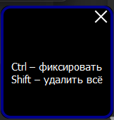
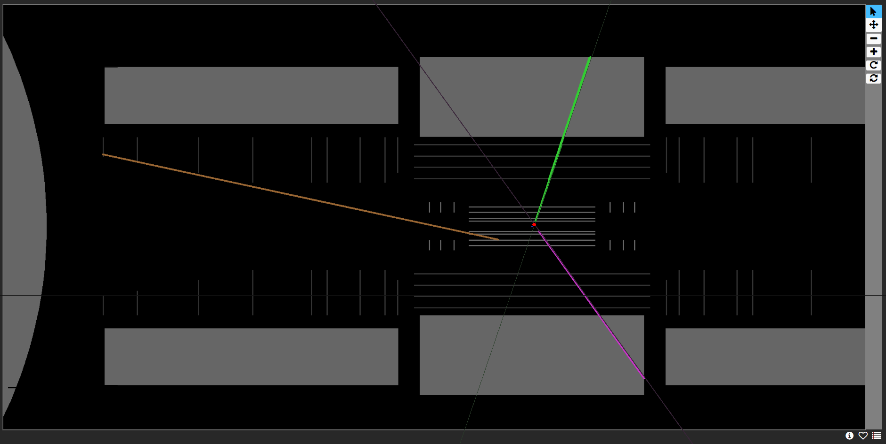
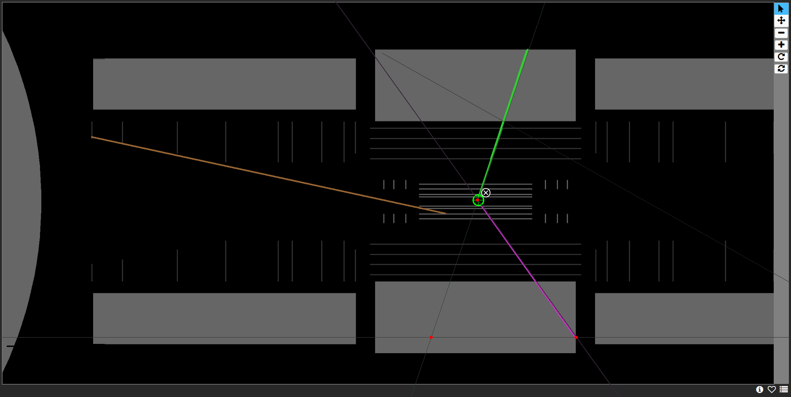
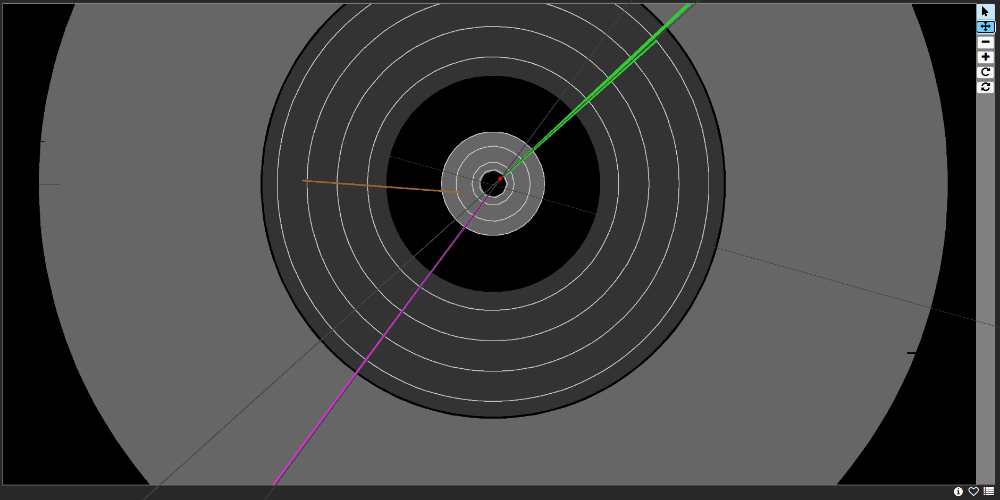
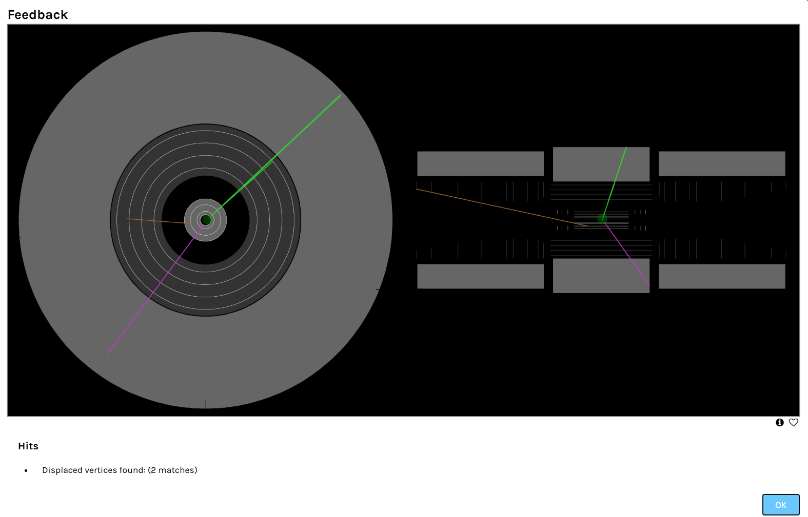

# LineGuide - утилита для выравнивания линий при калибровке детекторов Большого адронного коллайдера (CERN)
[Репозиторий на GitHub](https://github.com/antonstrobe/OverlayTool)  
Лицензия - MIT
 
 
---

## Описание (RU)

**LineGuide** - небольшая утилита захвата экрана и наложения направляющих линий, созданная для инженерных групп CERN. Она упрощает ручное совмещение контрольных точек при калибровке и выравнивании детекторов Большого адронного коллайдера (LHC), ускоряя расчёт геометрических констант и повышая точность трек‑реконструкции.

### Возможности

* Однокликовая привязка к сетке экрана.  
* Субпиксельные сдвиги (до 0,1 px) клавишами‑стрелками.  
* Проверено на Windows 10+; код переносим на Linux/macOS.  
* Без зависимостей от ROOT / CMSSW; распространяется как открытое ПО в духе политики CERN Open Science.

### Python и зависимости

* **Python ≥ 3.9 (64‑bit)**.  
* Установка:

  ```bash
  pip install -r requirements.txt
  # PyQt5, opencv-python, numpy, mss, pynput, pyinstaller
  ```

### Сборка .exe для Windows

Сценарий **build.bat** автоматизирует весь процесс: вызывает PyInstaller, проставляет версию и вшивает иконку.

```cmd
git clone https://github.com/antonstrobe/OverlayTool.git
cd OverlayTool
python -m pip install -r requirements.txt
build.bat        :: получаем dist\overlaytool.exe
```

---

## Description (EN)
# LineGuide - a line alignment utility for detector calibration at the Large Hadron Collider (CERN)
**LineGuide** is a lightweight screen‑overlay utility engineered at CERN to speed up manual alignment of detector fiducials for the Large Hadron Collider. By drawing razor‑sharp guide lines on top of any image it helps engineers match reference points faster, improving geometry recognition and reducing calibration time.

### Features

* One‑click snap‑to‑grid calibration.  
* Sub‑pixel nudging (0.1 px) with arrow keys.  
* Tested on Windows 10+; portable to Linux/macOS.  
* Pure Python; no ROOT/CMSSW runtime needed.

### Python & Dependencies

```bash
pip install -r requirements.txt
```

### Build .exe on Windows

A single **build.bat** script wraps PyInstaller, stamps the build version and embeds the icon-no manual commands needed.

```cmd
git clone https://github.com/antonstrobe/OverlayTool.git
cd OverlayTool
python -m pip install -r requirements.txt
build.bat        :: dist\overlaytool.exe ready
```

---

## Quick Start (Windows)

1. Запустите `overlaytool.exe` из **dist** или скачайте готовый релиз.  
2. Нажмите **Calibrate** и выберите оси.  
3. Совмещайте контрольные точки, используя стрелки и **Space** для фиксации линий.

---

## Демонстрация / Demo

| Step | Screenshot | CERN‑slang Commentary |
| ---- | ---------- | --------------------- |
| 1 |  | **Tooltip**: *Ctrl - фиксировать*, *Shift - зачистить*; всплывает перед стартом сессии. |
| 2 |  | **Barrel view**: черновые три track‑лайна по Pixel/Strip hits; вершина пока грубая. |
| 3 |  | **Fine‑tune**: линии «дожаты» до общего vertex; красный cross‑hair - ROI, зелёный circle - candidate. |
| 4 |  | **Endcap projection**: r‑φ проекция, overlay‑кольца помогают контролировать ∆z. |
| 5 |  | **Feedback dialog**: после Ctrl - displaced‑vertex check (2 matches) и комбинированный скрин. |

---

*Разработано в рамках инициатив CERN по открытому программному обеспечению. Pull Requests приветствуются!*
